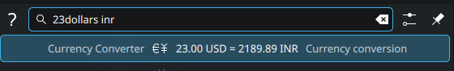
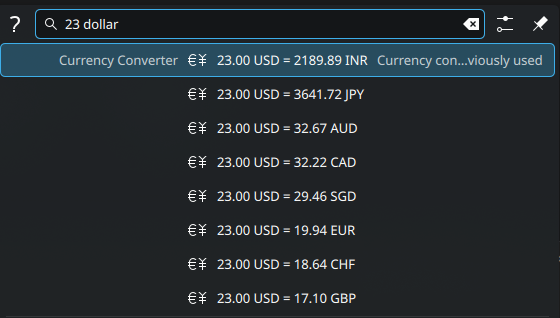

# KurrencyKonverter

A [KRunner](https://userbase.kde.org/KRunner) plugin for KDE Plasma that converts currencies instantly from your launcher. Type `23 dollars inr` or `50 eur` for a quick conversion or a shortlist of common currencies — no browser, no separate app. Understands `1k`/`5M`/`2B` and `thousand`/`million`/`billion` shorthand, and formats large results with digit-grouping separators. Remembers your last-used currency, shows it first, and copies results to your clipboard. Live exchange rates, cached locally.

## Screenshots

Give a target currency and get a single result:



Leave the target out and get a shortlist of common currencies — whichever one you picked last is remembered and shown first:



## Features

- **Natural queries** — `23 dollars inr`, `23dollars inr`, `100 usd to eur`, `50 eur` all work.
- **Magnitude shorthand** — `1k`, `10M`, `2.5B` (glued to the number) or `thousand`/`million`/`billion` (as a separate word) all work as multipliers, e.g. `1k usd inr` or `5 million eur`.
- **Grouped-digit results** — large numbers are shown with thousands separators (e.g. `1,000,000.00`) so results in currencies like JPY don't turn into an unreadable wall of digits. Configurable, see [Settings](#settings) below.
- **Shortlist mode** — no target currency? See it converted to USD, EUR, GBP, INR, JPY, AUD, CAD, CHF, CNY and SGD at once.
- **Remembers your last pick** — select a currency from the shortlist once, and it's shown first (labeled "previously used") next time.
- **Copy to clipboard** — selecting a result copies the converted value.
- **Live exchange rates** — fetched from a free, keyless API and cached locally, so lookups are instant and still work offline once cached.

## Requirements

- KDE Plasma 6 with KRunner (KF6)
- CMake ≥ 3.16, a C++17 compiler
- Qt6 (Core, Gui, Network) and KDE Frameworks 6 (Runner, CoreAddons, Config)

On Arch Linux:

```sh
sudo pacman -S cmake qt6-base kcoreaddons krunner kconfig
```

(Package names will differ slightly on other distros — you need the `-dev`/headers packages for Qt6 and the KF6 Runner/CoreAddons/Config frameworks.)

## Install

```sh
git clone https://github.com/Vinayak-09/kurrencykonverter.git
cd kurrencykonverter
./install.sh
```

`install.sh` configures, builds, and installs the plugin system-wide (via `sudo`, falling back to `pkexec`), then restarts KRunner. Open KRunner (<kbd>Alt</kbd>+<kbd>Space</kbd> or <kbd>Alt</kbd>+<kbd>F2</kbd>) and try `23 dollars inr`.

### Manual build

```sh
cmake -B build -S .
cmake --build build
sudo cmake --install build
kquitapp6 krunner   # restart so it picks up the new plugin
```

## Usage

| Query               | Result                                          |
|---------------------|--------------------------------------------------|
| `23 dollars inr`     | Converts 23 USD to INR                          |
| `23dollars inr`      | Same — spacing doesn't matter                   |
| `100 usd to eur`     | Converts 100 USD to EUR                         |
| `50 eur`             | Shows 50 EUR converted to a shortlist of common currencies |
| `1k usd inr`         | Converts 1,000 USD to INR (`k` = thousand)      |
| `10M usd`            | Shows 10,000,000 USD converted to the shortlist (`M` = million) |
| `2.5B jpy inr`       | Converts 2,500,000,000 JPY to INR (`B` = billion) |
| `5 thousand usd inr` | Same idea, spelled out as a word instead of a letter |

Supported currency words include full names, plurals, common slang, and symbols (`dollar`/`dollars`/`usd`/`$`, `euro`/`eur`/`€`, `rupee`/`inr`/`₹`, `pound`/`gbp`/`£`, `yen`/`jpy`/`¥`, and more — see `src/currencydata.h`), plus any raw 3-letter ISO 4217 code.

Amounts can include grouping commas too, in either style — `1,234,567` or the Indian `10,00,000` both parse to the same number.

## Settings

Open **System Settings → Search → Plugins**, find **Currency Converter**, and click its configure (gear) icon to:

- Toggle whether results are shown with digit-grouping separators (e.g. `1,000,000.00` vs `1000000.00`).
- Set how many decimal places to show.

## Uninstall

```sh
./uninstall.sh
```

Removes the installed plugin and, if you confirm, the cached exchange rates and remembered currency too.

## How it works

- Exchange rates come from [Frankfurter](https://frankfurter.dev) (ECB reference rates), a free API that needs no key. They update once per business day, not intraday.
- Rates are cached at `~/.cache/kurrencykonverter/rates.json`; the plugin fetches fresh data in the background when the cache is older than 6 hours, and blocks briefly on the very first run if there's no cache yet.
- The last currency you picked from the shortlist is stored per-user in `krunnerrc` under `[Runners][kurrencykonverter]`.

## License

[GPL-3.0-or-later](LICENSE)

## Credits

- Exchange rate data from [Frankfurter](https://frankfurter.dev), based on European Central Bank reference rates.
